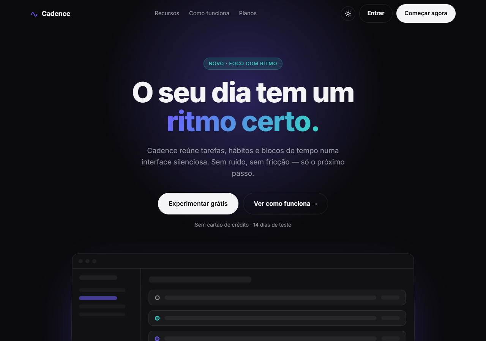

# Cadence

Landing page de um app fictício de produtividade. Fiz como estudo de layout no estilo
"Apple-like": bastante respiro, tipografia grande, animações discretas e dark mode.

Sem framework — é HTML, CSS e um pouco de JS. A ideia era justamente ver até onde dá
pra chegar só com o básico bem feito.



## O que tem aqui

- Hero com mockup em perspectiva e glow animado
- Reveal das seções no scroll (IntersectionObserver, sem libs)
- Contadores animados nas métricas
- Toggle de planos mensal/anual
- Dark/light com preferência salva no `localStorage`
- Responsivo e com `prefers-reduced-motion` respeitado

## Rodando

É estático, então qualquer servidor serve. Eu uso:

```bash
npx serve .
# ou
python -m http.server 8000
```

E abre `http://localhost:8000`.

## Estrutura

```
.
├── index.html
├── css/styles.css
├── js/main.js
└── docs/preview.png
```

## Por quê

Queria um projetinho pra fechar o assunto "dá pra fazer landing bonita sem React?".
Acho que dá. As variáveis CSS deixam o tema bem fácil de mexer — é só trocar os tokens
lá no `:root`.
